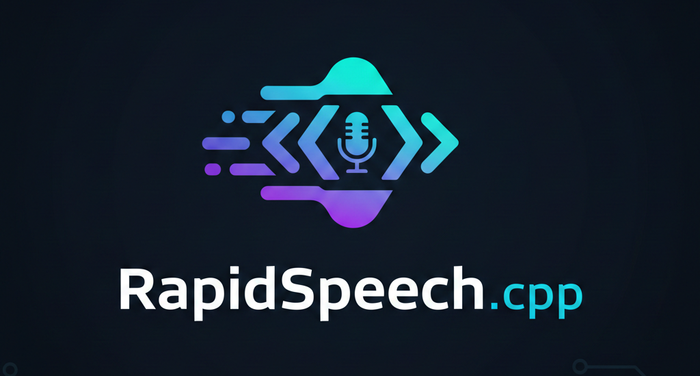

<div align="center">

</div>

简体中文 | [English](./README.md)

<a href="https://huggingface.co/lovemefan/RapidSpeech" target="_blank"></a>
<a href="https://www.modelscope.cn/models/lovemefan/RapidSpeech" target="_blank"></a>
<a href="https://github.com/RapidAI/RapidSpeech.cpp/stargazers"></a>

# RapidSpeech.cpp 🎙️

**RapidSpeech.cpp** 是一个基于 **ggml** 构建的高性能、边缘原生（Edge-native）语音智能框架，致力于为 ASR（自动语音识别）与 TTS（语音合成）大模型提供 **纯 C++、零依赖、可端侧部署** 的推理解决方案。

------

## 🌟 核心差异化优势

在当前开源生态中，云端侧已有如 **vLLM-omni** 等高吞吐推理框架，端侧也有 **sherpa-onnx** 这样成熟的工具链。而 **RapidSpeech.cpp** 则在以下关键维度实现了代际突破。

### 1. 对比 vLLM：边缘计算优先，而非云端吞吐优先

- **vLLM**
    - 面向数据中心与云端部署
    - 强依赖 Python 运行时与 CUDA
    - 通过 PageAttention 等技术最大化 GPU 吞吐

- **RapidSpeech.cpp**
    - 面向 **边缘计算与端侧推理**
    - 强调 **低延迟、低内存占用与轻量化**
    - 可运行于嵌入式设备、移动端、普通笔记本，甚至无 GPU 的 NPU 平台
    - **无需 Python 运行环境**

### 2. 对比 sherpa-onnx：更深度的底层掌控能力

| 维度 | sherpa-onnx（ONNX Runtime） | **RapidSpeech.cpp（ggml）** |
| --- | --- | --- |
| **内存管理** | 依赖 ORT 内部机制，内存行为相对不可控 | **零运行时内存分配**，在计算图构建阶段完成内存规划，最大限度避免端侧 OOM |
| **量化能力** | 以 INT8 为主，对超低比特支持有限 | **完整 K-Quants 量化体系**（Q4_K / Q5_K / Q6_K 等），在保证精度的同时显著降低带宽与内存压力 |
| **GPU 性能** | 通过 EP 映射，存在通用算子转换开销 | **原生后端优化**，直接使用 `ggml-cuda` / `ggml-metal`，推理效率显著优于 `onnxruntime-gpu` |
| **部署形态** | 通常依赖动态库与外部配置文件 | **单一可执行文件**，模型与配置统一封装于 **GGUF**，部署即运行 |

------

## 📦 模型支持

**语音识别（ASR）**
- [x] SenseVoice-small
- [ ] FunASR-nano
- [ ] Qwen3-ASR

**Text-to-Speech (TTS)**
- [ ] CosyVoice3
- [ ] Qwen3-TTS

------

## 🏗️ 架构设计

RapidSpeech.cpp 并非“单模型推理工具”，而是一套面向真实业务场景设计的完整语音框架：

- **核心引擎（Core Engine）**  
  基于 `ggml` 的高性能计算后端，支持从 INT4 到 FP32 的混合精度推理。

- **架构层（Architecture Layer）**  
  插件式模型构建与加载机制，规划支持 FunASR-nano、CosyVoice、Qwen3-TTS 等主流模型体系。

- **业务逻辑层（Business Logic）**  
  内置环形缓冲区、VAD（端点检测）、文本前端（如音素化）以及多会话并发管理能力。

------

## 🚀 核心特性

- [ ] **极致量化支持**：原生支持 4-bit / 5-bit / 6-bit 量化方案，充分适配不同算力与带宽条件的硬件。
- [ ] **零依赖部署**：纯 C/C++ 实现，最终产物为单一、轻量级二进制文件。
- [ ] **GPU / NPU 加速**：针对语音模型特点，对 CUDA 与 Metal 后端进行定制化优化。
- [ ] **统一模型格式**：ASR 与 TTS 统一采用扩展后的 **GGUF** 模型格式。

------

## 🛠️ 快速开始（开发中）

### 模型下载

请从以下平台下载对应模型：

- 🤗 Hugging Face：https://huggingface.co/lovemefan/RapidSpeech
- ModelScope：https://www.modelscope.cn/models/lovemefan/RapidSpeech

### 构建与运行

```bash
git clone https://github.com/RapidAI/RapidSpeech.cpp
cd RapidSpeech.cpp
cmake -B build
cmake --build build --config Release

./build/rs-asr-offline \
  -m /path/to/SenseVoice/sense-voice-small-fp32.gguf \
  -w /path/to/test_sample_rate_16k.wav
```
------

## 🤝 参与贡献

如果你对以下领域感兴趣，欢迎提交 PR 或参与讨论：

- 适配更多模型。
- 完善项目框架。