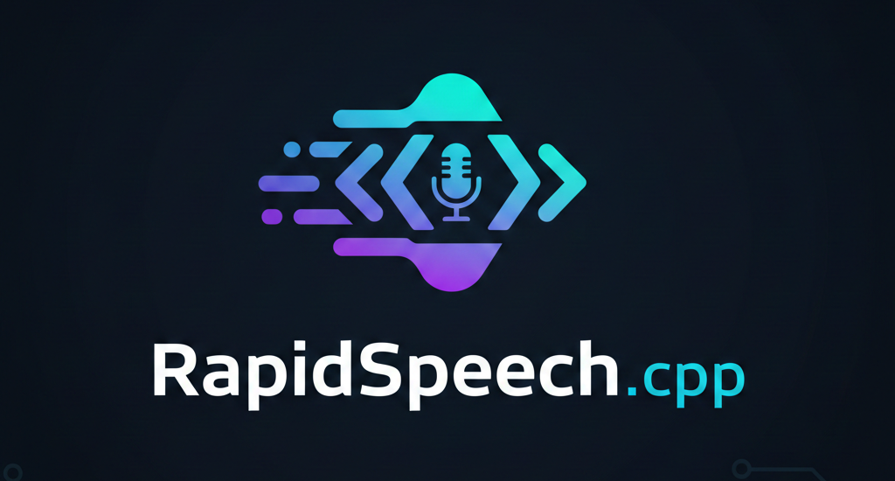

<div align="center">

</div>

简体中文 | [English](./README.md)

<a href="https://huggingface.co/RapidAI/RapidSpeech" target="_blank"></a>
<a href="https://www.modelscope.cn/models/RapidAI/RapidSpeech" target="_blank"></a>
<a href="https://github.com/RapidAI/RapidSpeech.cpp/stargazers"></a>

# RapidSpeech.cpp 🎙️

**RapidSpeech.cpp** 是一个基于 **ggml** 构建的高性能、边缘原生（Edge-native）语音智能框架，致力于为 ASR（自动语音识别）与 TTS（语音合成）大模型提供 **纯 C++、零依赖、可端侧部署** 的推理解决方案。

------

## 🌟 核心差异化优势

在当前开源生态中，云端侧已有如 **vLLM-omni** 等高吞吐推理框架，端侧也有 **sherpa-onnx** 这样成熟的工具链。而 **RapidSpeech.cpp** 则在以下关键维度实现了代际突破。

### 1. 对比 vLLM：边缘计算优先，而非云端吞吐优先

- **vLLM**
    - 面向数据中心与云端部署
    - 强依赖 Python 运行时与 CUDA
    - 通过 PageAttention 等技术最大化 GPU 吞吐

- **RapidSpeech.cpp**
    - 面向 **边缘计算与端侧推理**
    - 强调 **低延迟、低内存占用与轻量化**
    - 可运行于嵌入式设备、移动端、普通笔记本，甚至无 GPU 的 NPU 平台
    - **无需 Python 运行环境**

### 2. 对比 sherpa-onnx：更深度的底层掌控能力

| 维度 | sherpa-onnx（ONNX Runtime） | **RapidSpeech.cpp（ggml）** |
| --- | --- | --- |
| **内存管理** | 依赖 ORT 内部机制，内存行为相对不可控 | **零运行时内存分配**，在计算图构建阶段完成内存规划，最大限度避免端侧 OOM |
| **量化能力** | 以 INT8 为主，对超低比特支持有限 | **完整 K-Quants 量化体系**（Q4_K / Q5_K / Q6_K 等），在保证精度的同时显著降低带宽与内存压力 |
| **GPU 性能** | 通过 EP 映射，存在通用算子转换开销 | **原生后端优化**，直接使用 `ggml-cuda` / `ggml-metal`，推理效率显著优于 `onnxruntime-gpu` |
| **部署形态** | 通常依赖动态库与外部配置文件 | **单一可执行文件**，模型与配置统一封装于 **GGUF**，部署即运行 |

------

## 📦 模型支持

**语音识别（ASR）**
- [x] SenseVoice-small
- [x] FunASR-nano
- [ ] Qwen3-ASR
- [ ] FireRedASR2

**语音合成（TTS）**
- [ ] CosyVoice3
- [ ] Qwen3-TTS

------

## 🏗️ 架构设计

RapidSpeech.cpp 并非"单模型推理工具"，而是一套面向真实业务场景设计的完整语音框架：

- **核心引擎（Core Engine）**
  基于 `ggml` 的高性能计算后端，支持从 INT4 到 FP32 的混合精度推理。

- **架构层（Architecture Layer）**
  插件式模型构建与加载机制，规划支持 FunASR-nano、CosyVoice、Qwen3-TTS 等主流模型体系。

- **业务逻辑层（Business Logic）**
  内置环形缓冲区、VAD（端点检测）、文本前端（如音素化）以及多会话并发管理能力。

------

## 🚀 核心特性

- **极致量化支持**：原生支持 4-bit / 5-bit / 6-bit 量化方案，充分适配不同算力与带宽条件的硬件。
- **零依赖部署**：纯 C/C++ 实现，最终产物为单一、轻量级二进制文件。
- **GPU / NPU 加速**：针对语音模型特点，对 CUDA 与 Metal 后端进行定制化优化。
- **统一模型格式**：ASR 与 TTS 统一采用扩展后的 **GGUF** 模型格式。
- **Python 绑定**：通过 pybind11 提供 Python 接口，支持 pip 安装，一行代码即可调用。

------

## 🛠️ 快速开始

### 模型下载

请从以下平台下载对应模型的 GGUF 格式文件：

- 🤗 Hugging Face：https://huggingface.co/RapidAI/RapidSpeech
- ModelScope：https://www.modelscope.cn/models/RapidAI/RapidSpeech

### C++ 构建

#### 基本构建（仅 CPU）

```bash
git clone https://github.com/RapidAI/RapidSpeech.cpp
cd RapidSpeech.cpp
git submodule sync && git submodule update --init --recursive
cmake -B build
cmake --build build --config Release
```

#### 启用 GPU 加速

<details>
<summary>🍎 macOS Metal（默认启用）</summary>

macOS 平台默认启用 Metal 加速，无需额外配置：

```bash
cmake -B build
cmake --build build --config Release
```

</details>

<details>
<summary>🖥️ NVIDIA CUDA</summary>

```bash
cmake -B build -DRS_CUDA=ON -DCMAKE_CUDA_COMPILER=/usr/local/cuda/bin/nvcc
cmake --build build --config Release
```

</details>

<details>
<summary>🌋 Vulkan</summary>

```bash
cmake -B build -DRS_VULKAN=ON
cmake --build build --config Release
```

</details>

<details>
<summary>⚡ 华为 CANN（Ascend NPU）</summary>

```bash
cmake -B build -DRS_CANN=ON
cmake --build build --config Release
```

</details>

### C++ 命令行使用

构建完成后，使用 `rs-asr-offline` 进行离线语音识别：

```bash
# 基本用法
./build/rs-asr-offline \
  -m /path/to/model.gguf \
  -w /path/to/audio.wav

# 指定线程数和 GPU
./build/rs-asr-offline \
  -m /path/to/model.gguf \
  -w /path/to/audio.wav \
  -t 8 \
  --gpu 1
```

**命令行参数：**

| 参数 | 说明                         | 默认值 |
| --- |----------------------------|-----|
| `-m, --model` | 模型文件路径（必选）                 | -   |
| `-w, --wav` | WAV 音频文件路径（可选，不提供则使用测试正弦波） | -   |
| `-t, --threads` | CPU 线程数                    | 4   |
| `--gpu` | 是否启用 GPU 加速（`0`/`1`）       | 1   |
| `-h, --help` | 显示帮助信息                     | -   |

### Python 使用

#### 安装

**方式一：pip 安装（推荐）**

```bash
# CPU 版本
pip install rapidspeech

# CUDA 版本
pip install rapidspeech-cuda

# Metal 版本（macOS）
pip install rapidspeech-metal
```

**方式二：从源码构建**

```bash
git clone https://github.com/RapidAI/RapidSpeech.cpp
cd RapidSpeech.cpp
git submodule sync && git submodule update --init --recursive

# 构建 Python 绑定
pip install .

# 或指定 CUDA 后端
RS_BACKEND=cuda pip install .
```

#### Python API 使用示例

```python
import numpy as np
import rapidspeech

# 1. 初始化 ASR 离线识别器
asr = rapidspeech.asr_offline(
    model_path="/path/to/model.gguf",
    n_threads=4,
    use_gpu=True
)

# 2. 读取音频数据（float32, 16kHz, 单声道）
# pcm 为 numpy float32 数组，值域 [-1.0, 1.0]
pcm = load_wav("audio.wav")  # 自行实现 WAV 读取，或使用 soundfile / scipy.io.wavfile

# 3. 推送音频数据
asr.push_audio(pcm)

# 4. 执行推理
asr.process()

# 5. 获取识别结果
text = asr.get_text()
print(f"识别结果: {text}")
```

**完整的离线识别示例脚本**可参考 [`python-api-examples/asr/asr-offline.py`](./python-api-examples/asr/asr-offline.py)。

运行示例：

```bash
python python-api-examples/asr/asr-offline.py \
  --model /path/to/model.gguf \
  --audio /path/to/audio.wav \
  --threads 4 \
  --gpu 1
```

#### Python API 参考

| 类/方法 | 说明 |
| --- | --- |
| `rapidspeech.asr_offline(model_path, n_threads=4, use_gpu=True)` | 创建离线 ASR 识别器 |
| `asr.push_audio(pcm)` | 推送 float32 音频数据（numpy 一维数组） |
| `asr.process()` | 执行推理，返回状态码（0=无输出, 1=有输出, -1=错误） |
| `asr.get_text()` | 获取识别文本结果 |

### C API 参考

RapidSpeech 提供 C 语言接口，便于集成到其他语言和项目中。核心接口如下：

```c
#include "rapidspeech.h"

// 初始化
rs_init_params_t params = rs_default_params();
params.model_path = "/path/to/model.gguf";
params.n_threads   = 4;
params.use_gpu     = true;
rs_context_t* ctx = rs_init_from_file(params);

// 推送音频并推理
rs_push_audio(ctx, pcm_data, num_samples);
int32_t status = rs_process(ctx);

// 获取结果
const char* text = rs_get_text_output(ctx);

// 释放资源
rs_free(ctx);
```


------

## 🔧 开发与构建选项

### CMake 选项

| 选项 | 说明 | 默认值 |
| --- | --- | --- |
| `RS_BUILD_TESTS` | 构建测试可执行文件 | ON |
| `RS_CUDA` | 启用 CUDA 加速 | OFF |
| `RS_METAL` | 启用 Metal 加速（仅 macOS） | 自动检测 |
| `RS_VULKAN` | 启用 Vulkan 加速 | OFF |
| `RS_CANN` | 启用华为 CANN 加速 | OFF |
| `RS_OPENCL` | 启用 OpenCL 加速 | OFF |
| `RS_ENABLE_PYTHON` | 启用 Python 绑定（pybind11） | OFF |

### 模型转换

使用项目提供的脚本将 Hugging Face 模型转换为 GGUF 格式：

```bash
python scripts/convert_hf_to_gguf.py --model /path/to/hf-model --output /path/to/output.gguf
```

------

## 🤝 参与贡献

如果你对以下领域感兴趣，欢迎提交 PR 或参与讨论：

- 适配更多模型（Qwen3-ASR、CosyVoice3 等）
- 完善项目框架与性能优化
- 改进文档与示例

## 致谢

1. [Fun-ASR](https://github.com/FunAudioLLM/Fun-ASR)
2. [llama.cpp](https://github.com/ggml-org/llama.cpp)
3. [ggml](https://github.com/ggml-org/ggml)
